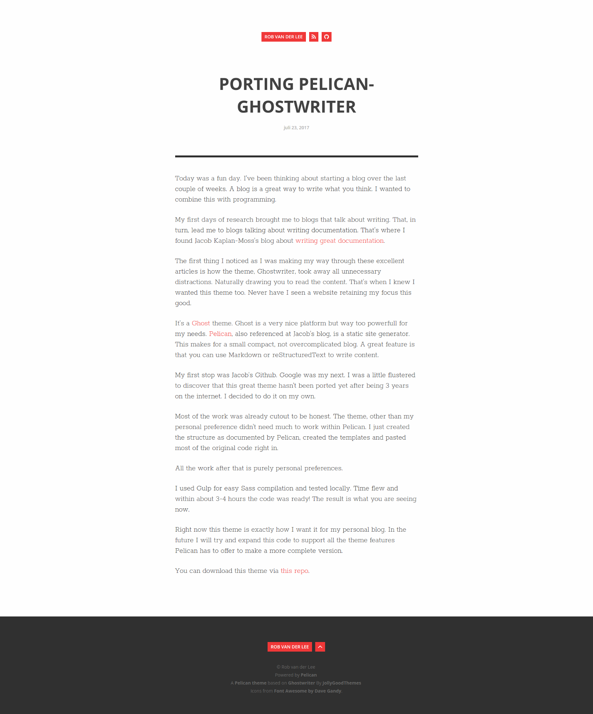

A theme port for Pelican based on Ghostwriter by Rory Gibson. This theme has been created with passion. I took it upon me to port this wonderfull, amazing and sexy theme to Pelican. You can find a screenshot at the bottom of this readme.

## Installation

These instructions will get you up and running with this theme in no time. Most of the following steps are applicable to setting up Pelican with any theme.

First we clone the repository to our computer. My personal preference is to store themes in the `~/pelican-themes/` folder. It is easily accessible and it keeps your themes together nicely.

```bash
cd ~/pelican-themes
git clone https://github.com/EpicSoftworks/pelican-ghostwriter
```

I assume you've already setup your Pelican blog. You can refer to the official [quickstart guide](http://docs.getpelican.com/en/3.6.3/quickstart.html) if you haven't before continuing to the next step.

There are two ways to make use of this theme. You can pass the theme's location as an argument to the `pelican content` command.

```bash
pelican content -t '~/pelican-themes/pelican-ghostwriter'
```

or add the `THEME` option to your `pelicanconf.py` config file.

```python
THEME = '~/pelican-themes/pelican-ghostwriter'
```

After it has generated your blog it should show up! Happy writing!

## Modify to taste

I made some changes to the theme that are purely to personal taste. To modify you can start `gulp watch` that will check if you've made changes to sass files.  When you do it will automatically compile the files and put them in the right directory.

Simple re-run `pelican content` to embed your changes to your blog.

You should also check `templates/base.html` if you want to change the main font. I'm using Rokkitt from Google fonts, change it here if you want to change this to something else, then head over to `sass/partials/typography.scss` to change the font name respectivly. Don't forget to run `gulp watch` before you start.

## Build with

* [`Atom`](https://atom.io/) - Github's Editor for code
* [`Gulp`](http://gulpjs.com/) - Automating my process
* [`Sass`](http://sass-lang.com/) - Making styling easier
* [`Google Fonts`](https://fonts.google.com/) - Rokkitt and Open Sans

## Special Thanks

* [`JollyGoodThemes`](http://jollygoodthemes.com/) - Developing this theme under MIT!
* [`Font Awesome`](http://fontawesome.io/) - Easy to use, awesome, suits most needs
* [`Pelican`](https://blog.getpelican.com/) - The tool to power static blogs
* [`Guido van Rossum`](https://www.python.org/) - Maker and ruler of Python

## License

This project is licensed under the MIT License - see the LICENSE.md file for details

## Screenshot


